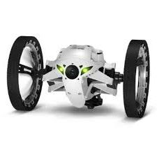

#   Sumo4scratch  
*from Stefan Höhn*

[Tobias Schneider]: https://github.com/derTobsch
[Scratch-Offline-Editor]: https://scratch.mit.edu/scratch2download/
[Jumping Sumo Drone]: http://www.parrot.com/usa/products/jumping-sumo/
[Parrot]: http://www.parrot.com/
Proxy Server Implementation to bridge Jumping Sumo commands within the [Scratch-Offline-Editor] with the help of the [DroneController-Library] (by [Tobias Schneider]) via Wireless to the[Jumping Sumo Drone] from [Parrot].

[DroneController-Library]: https://github.com/Devoxx4KidsDE/drone-controller
[activator]: https://www.lightbend.com/activator/download

## Instructions

### Build, distribute and run the Sumo4Scratch server

To build the server the setup is pretty simple. All you need to have, is at least Java 8 and [activator] installed

* To build a standalone server you need to have [activator} installed on your machine (something that any scala developer will have anyway). 
* Go to the homedirectory of your project and type activator (it should come about with [ Sumo4Scratch ] in the prompt.)
* Enter "dist" and return. It will then build a zip-file with all required dependencies. It will tell you at the end what the location is where the zip was saved.
* Now you can distribute that zip file to anyone. The system that you run it on should have at least Java 8 installed.
* Unpack the zip file, goto \bin-directory and start "sumo4scratch"
* This will run the server listening on port 9000

### Setup Scratch to Sumo4Scratch

*Language of the extension*: The blocks currently appear in the German only. As soon as we have left the alpha-version, we will provide a translated one. However, if you cannot wait, translating is more than easy and probably only takes a few minutes: Just open the [sumo4Scratch.s2e] and look for the blockspecs-section. Translate the second string entry to the language you like (Google translate is definitely your friend here, I am sure...).

[sumo4Scratch.s2e]: https://github.com/Devoxx4KidsDE/drone-controller/tree/master

* Download the file [sumo4Scratch.s2e] from github and save it on a convenient place as you need to open it from Scratch
* You need to have the Standalone-Version of Scratch running
* After you have startet Scratch, open "File" while *holding SHIFT* at the same time. This reveals a secret menu entry "Import Experimental Extension". Now you can chose the file [sumo4Scratch.s2e] which will be loaded by scratch
* Now you can go to the "more block" section of script tab and you will recognize the Jumping Sumo section.
* Drop the blocks into the code and have fun

## Using the extension

The usage of the blocks is straight forward and rather obvious. 

* use the *Connection* Block first, when a scratch program is started. With the block you can define to which drone you like to connect. If you have only one drone, just go for the default.
* There is also a *Sumo off* with which you can disconnect that can be used. Of course, after that you need use the *Connect* again
* Now you can
	* Move in any direction 
	* Turn by providing the angle in degrees
	* Jump high and far
	* Do some tricks
	* ... stay tuned - we will add more soon
	
[sumo-programm.sb2]: ./sumo-programm.sb2
There is a __sample program__ for Scratch that you can find in the root directory of the project which is called [sumo-programm.sb2].

Note: Currently only command at a time is supported. 